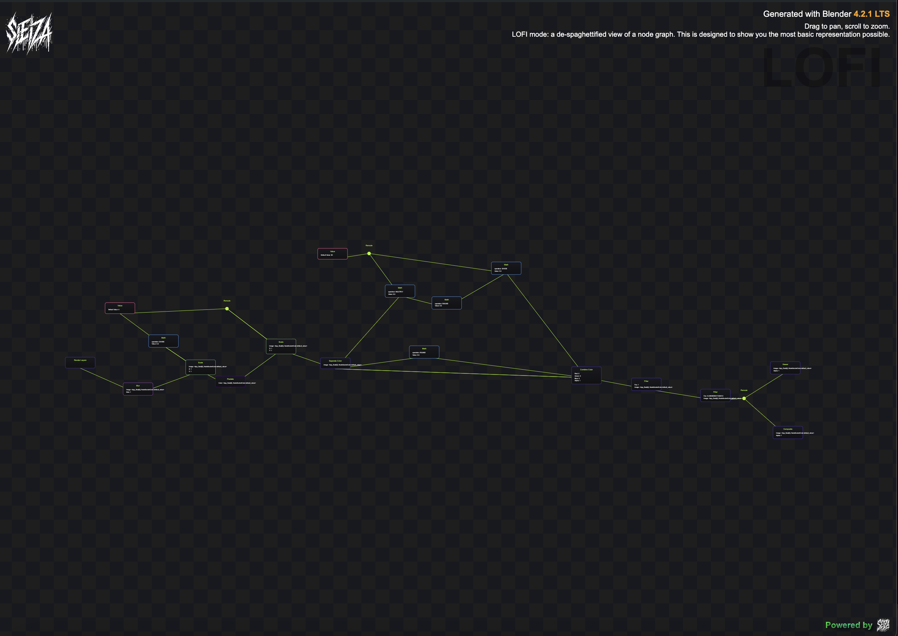

# Seiza (正座)

Seiza is a WIP toolset for generating easily shareable, embeddable, HTML node graphs from mapping your Blender materials and compositors with the help of D3.js.

---

## Installation

1. Clone the repository:
    ```bash
    git clone https://github.com/bruceki/Seiza.git
    ```

2. Ensure you have the required dependencies installed:
    - **Blender** (with Python API enabled)
      
---

## Usage

Export scripts are kept in the Blender folder so feel free to use them as a part of your pipeline if you need to turn your materials or compositors and all of their settings into JSON data at any point. That's literally all they do so it shouldn't be that hard to integrate them into an existing wokflow.

### 1. Compositor export

The first thing you need are some nodes, so let's export some into a JSON file. 

1. Load your Blender scene or create your compositor, and then switch over to the script panel. 
2. Copy + paste the script into your scripting tab and hit the play button.
3. The script will automatically output a JSON file to the same folder as your current blender file. Feel free to change the part at the bottom of c_seiza.py to something more to your liking if needed:

```python
# Example usage:
output_file = os.path.join(bpy.path.abspath("//"), "compositor_nodes.json")
export_compositor_node_data(output_file)
```

And that's about it for exporting! If all goes well, and if you use the example c_seiza.py provided in this repo, you should have yourself a compositor_nodes.json file in the same folder as your .blend project chock full of all of your shader data and ready for further processing or sharing. 👍🏻

---

### 2. Rendering the HTML version of the graph

Now to visualize! 



Currently Seiza only renders LOFI versions which are intended to strip away the spaghetti monster-ness and show the main structure of a shader, so don't expect high degrees of granularity at this time it's just a neat way to get an idea of how something was made with less visual clutter.

Go check out /HTML/index.html in your terminal. 

cd into the HTML directory and fire up a web server with python, 'python3 -m http.server 7800'

Once it's running go to your browser and go to localhost:7800 to see a standalone demo 

I have included some test data that I dropped in from a [tutorial]('wayofthedev.com/tutorials/custom-pixel-art-shader/') I made on creating a super simple, no-frills pixel art compositor in Blender for 3D characters. You should be able to see it immediately.


 